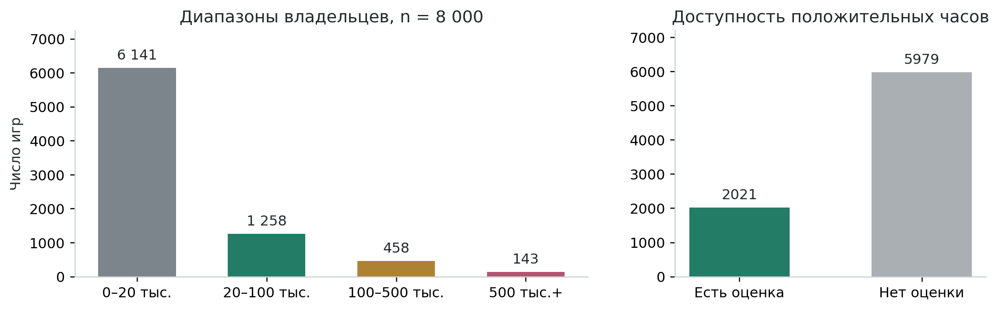
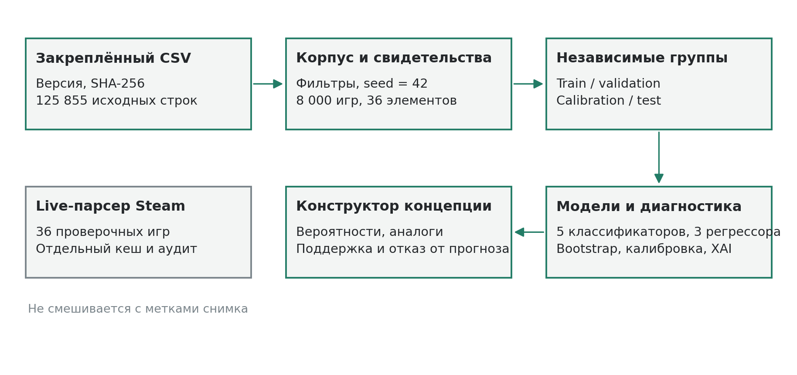
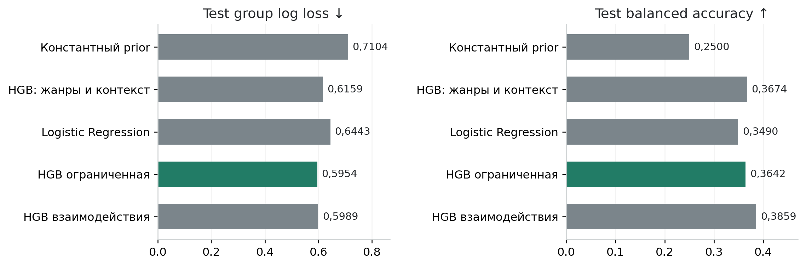
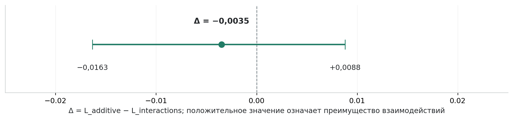
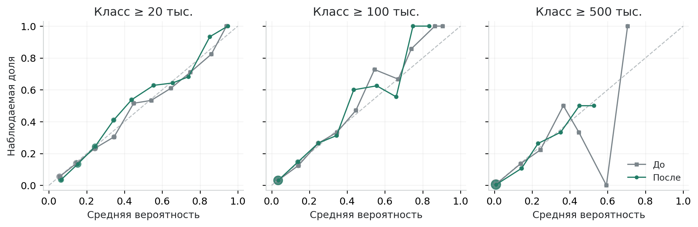
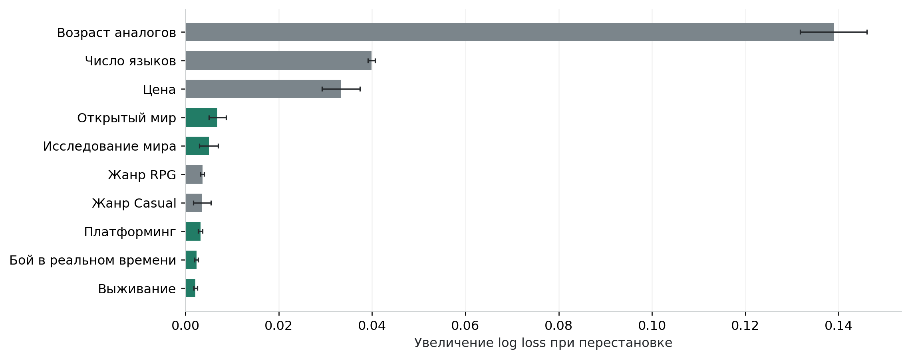
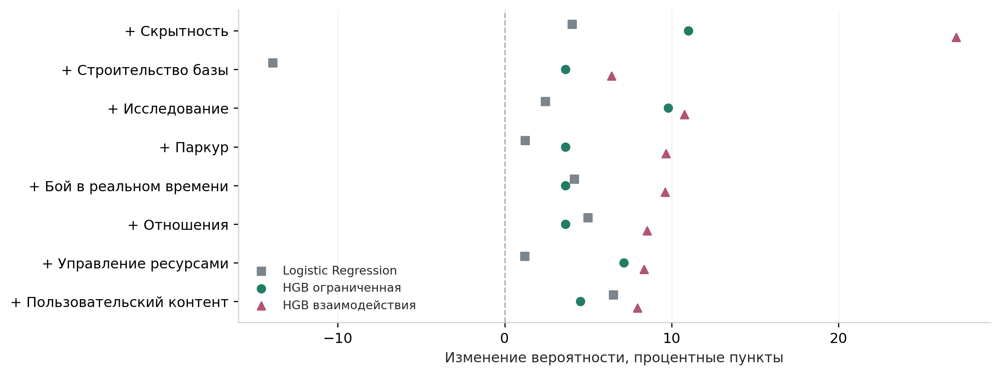
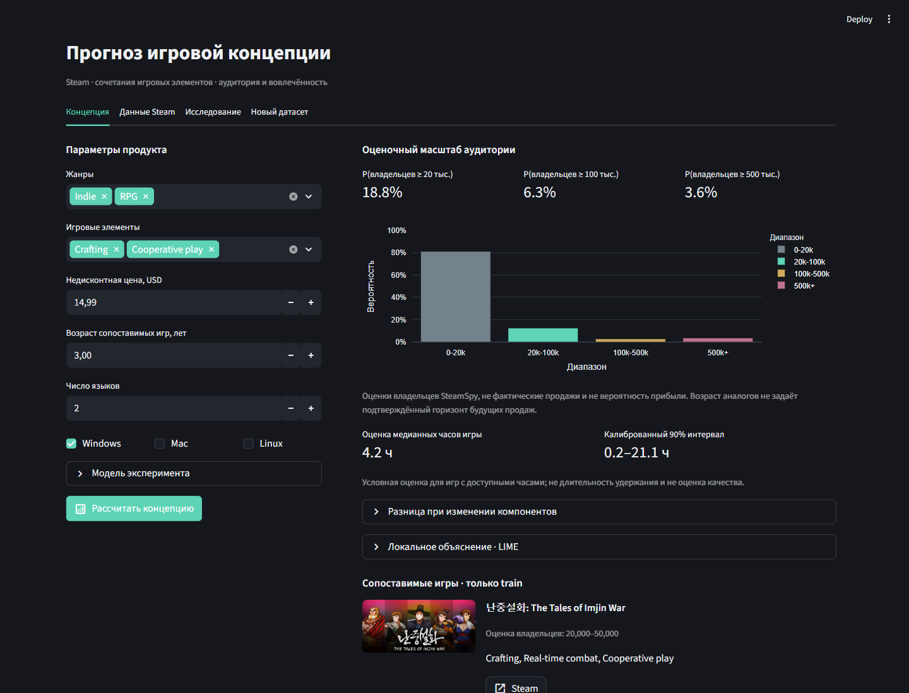

# Прогнозирование коммерческого потенциала игровой концепции по жанру и сочетаниям игровых механик на данных Steam

Исследовательская статья · Game Concept Lab · 8 октября 2026 года

## Аннотация

В работе исследуется возможность оценивать масштаб аудитории игровой концепции по характеристикам сопоставимых продуктов Steam. Разработан воспроизводимый конвейер подготовки данных, извлечения свидетельств игровых элементов и сравнения вероятностных моделей. Основная гипотеза состоит в том, что разрешение взаимодействий признаков в градиентном бустинге улучшает прогноз относительно сопоставимой модели с ограничением взаимодействий. Из закреплённого снимка сформирована выборка 8 000 платных игр; выделены 36 типов элементов и сохранены 18 846 свидетельств. Обучение, выбор модели, калибровка и тестирование разделены по связным группам разработчиков. По validation выбрана HGB с ограничением взаимодействий: её test group log loss равен 0,5954, у константного baseline составляет 0,7104. Разность ошибок основной пары составила −0,0035; 95% bootstrap-интервал: [−0,0163; +0,0088]. Убедительных свидетельств преимущества взаимодействий не получено. Создано настольное веб-приложение с конструктором концепций, сопоставимыми играми, объяснениями и отказом от прогноза при недостатке поддержки данными. Результат является ретроспективной оценкой диапазона владельцев, а не прогнозом фактических продаж, прибыли или когортного удержания.

**Ключевые слова:** игровая аналитика; Steam; коммерческий потенциал; игровые механики; градиентный бустинг; калибровка вероятностей; неопределённость; объяснимое машинное обучение.

## 1. Введение

На стадии формирования игровой концепции разработчик выбирает жанр, основные механики, цену и технические характеристики продукта. Практический вопрос заключается не только в том, насколько популярны отдельные элементы, но и в том, насколько существующие игры с похожей комбинацией достигали заметной аудитории. Простое суммирование популярности компонентов для этого недостаточно: оно не учитывает контекст и допускает необоснованно оптимистичный прогноз для сочетаний, почти не представленных в данных.

В настоящей работе предлагается исследовательский инструмент поддержки решений. Он не заменяет прототипирование, тестирование игрового опыта и финансовую модель. Его назначение состоит в сопоставлении концепции с наблюдаемыми продуктами, отображении вероятностных оценок и явном обозначении области, в которой данных недостаточно. Это позволяет обсуждать продуктовую гипотезу на основании эмпирических аналогов, не сводя анализ к перечню востребованных жанров.

Цель исследования состоит в проверке информативности игровых элементов и возможности использования взаимодействий признаков для прогноза масштаба аудитории, с оценкой ошибок и ограничений такого подхода. Дополнительная задача заключается в исследовании доступного игрового времени как ограниченного показателя вовлечённости. Работа ориентирована на анализ данных существующих игр: разработка собственной игры и сбор персональной телеметрии не требуются.

Для достижения цели решены пять задач:

1. Подготовить версионированный корпус с контролем источников, качества и воспроизводимости.
2. Построить извлечение игровых элементов с проверяемыми свидетельствами и протоколом ручного аудита.
3. Сравнить базовые и расширенные модели в условиях независимости групп разработчиков.
4. Оценить гипотезу, вероятности, интервалы и чувствительность прогнозов.
5. Реализовать приложение для оценки концепций и повторения эксперимента на совместимом наборе данных.

## 2. Методические основания и исследовательский вопрос

Исследование популярности Steam-игр по метаданным не является новой областью. De Luisa и соавторы рассматривают прогноз популярности в ранний период после релиза и байесовские модели с ценой, языками, датой и жанрами [12]. Grelier и Kaufmann исследуют словарь игровых описаний через пользовательские теги Steam и построение их таксономий [13]. Эти работы обосновывают анализ контекста и осторожное отношение к жанровым обозначениям, но не подтверждают качество настоящего прототипа: задачи, данные и процедуры проверки различаются, а опубликованные метрики здесь не воспроизводились.

Публичные метаданные Steam предоставляют описания, жанры, категории и теги. Однако теги формируются в системе Steam при участии разработчиков и пользователей [3]; они не являются независимой экспертной проверкой игрового процесса. Поэтому в работе разделяются структурированные признаки продукта, утверждения о механиках и качество их реализации. Последнее в используемом наборе непосредственно не измерено.

Вероятностный прогноз требует оценки не только классификационной точности, но и согласованности вероятностей с наблюдаемыми исходами. Эта проблема рассматривается, в частности, в исследованиях калибровки [5]. Метод LIME строит локальное интерпретируемое приближение сложной модели [6], а permutation importance позволяет исследовать чувствительность ошибки к изменению входов [9]. В данной работе эти методы служат диагностикой модели, а не доказательством причинного влияния механик.

Основной вопрос сформулирован следующим образом: **улучшает ли разрешение взаимодействий входных признаков прогноз оценочного диапазона владельцев по сравнению с сопоставимым бустингом с ограничением взаимодействий?** Альтернативная гипотеза H1 предполагает положительную разность ошибок Δ = L_additive − L_interactions. Нулевое объяснение соответствует отсутствию убедительных свидетельств положительного улучшения в выбранном протоколе. Если 95% интервал Δ пересекает ноль, H1 не получает убедительной поддержки; это не доказывает равенства моделей.

Собственный вклад состоит в соединении доказательного извлечения элементов, контроля зависимых наблюдений, сопоставимого эксперимента и конструктора с проверкой поддержки концепции. Новый алгоритм машинного обучения с нуля не заявляется. Выполненный обзор обосновывает используемые методы, но не устанавливает мировой приоритет предлагаемого приложения. Протокол текущей итерации также не является предварительной регистрацией всего исследования.

## 3. Данные и подготовка корпуса

### 3.1. Источник, версия и условия использования

Основным источником служит Steam Games Dataset, опубликованный FronkonGames на Hugging Face [1]; код исходного сборщика доступен отдельно [10]. Для эксперимента закреплена ревизия `ba4e26785af33bee500e96597068c6e77f4edea9` и CSV версии 20.06.2026. Используется именно этот файл, а не изменяемая текущая версия набора или автоматически преобразованный Parquet. Размер исходного CSV составляет 401 140 503 байта. Его контрольная сумма приведена в приложении А.

Карточка набора указывает лицензию MIT [1]. Это описание лицензии компиляции данных, а не установленное разрешение на свободное переиздание всех рекламных текстов, обложек и товарных знаков. В проекте исходные тексты и HTTP-кеш остаются локально; для распространения предусмотрены код и агрегированные результаты. Представленная оценка прав не заменяет отдельную юридическую проверку условий конкретного использования.

Внешний снимок необходимо отличать от собственного прямого парсинга. Разработанный парсер обработал 36 игр через публичные ответы Steam; у 7 из них HTML-страница оказалась недоступной или ограниченной, поэтому теги страницы не восстановлены. Парсер проверяет robots.txt, использует паузы, ограниченные повторы, контрольные суммы и архивирование ответов. Авторизация, возрастные ограничения, CAPTCHA и запреты доступа не обходятся. Этот небольшой целевой сбор проверяет техническую работоспособность, а не репрезентативность рынка и не качество всей разметки. Свежие метаданные не смешиваются автоматически с метками старого снимка.

### 3.2. Отбор и качество данных

В исходном файле обнаружен объединённый заголовок `DiscountDLC count`. При чтении явно восстановлены два имени столбцов, без изменения исходного файла и с записью исправления в аудит. Фильтры включают положительную цену, дату релиза не ранее 2010 года, возраст не менее 180 дней относительно даты версии файла, непустого разработчика, описание длиной не менее 80 символов, поддерживаемый жанр и корректный owner-диапазон. Демо, плейтесты, саундтреки и выделенные серверы исключаются по названию; этот эвристический фильтр не гарантирует идеальную идентификацию типа приложения.

Из 125 855 строк условия прошли 89 170. Затем по приоритету SHA-256(seed:AppID) при seed = 42 отобраны 8 000 игр. Отбор не зависит от принадлежности к успешному классу, однако фильтрация платных и достаточно описанных продуктов ограничивает генеральную совокупность. Дата файла не заменяет неизвестный момент сбора каждой записи.

**Таблица 1. Состав подготовленного корпуса.**

| Характеристика | Значение |
| --- | --- |
| Строк исходного CSV | 125 855 |
| Игры после фильтрации | 89 170 |
| Подготовленная выборка | 8 000 |
| Типы игровых элементов | 36 |
| Записи свидетельств элементов | 18 846 |
| Кандидаты особенных возможностей | 11 359 |
| Игры с доступными часами | 2 021 |

### 3.3. Целевые переменные

Основная целевая переменная принимает один из четырёх укрупнённых диапазонов оценочного числа владельцев: 0–20 тыс., 20–100 тыс., 100–500 тыс. и 500 тыс. и более. Исходный интервал принимается только тогда, когда целиком помещается в соответствующий класс. Его середина не выдаётся за точное число пользователей. SteamSpy отдельно подчёркивает, что владение не тождественно продаже: игру можно получить через разные каналы и акции [2]. Поэтому вероятности классов интерпретируются как прогноз метки источника, а не как вероятность финансового успеха.

Для дополнительной задачи используется медианное накопленное игровое время из источника, переведённое из минут в часы. Положительная доступная оценка присутствует только у 2 021 игр, то есть у 25,3% корпуса. Остальные значения считаются отсутствующими или ненадёжными, а не реальным нулевым интересом. Это показатель на уровне игры, а не пользовательская когорта: его нельзя интерпретировать как D7/D30-retention. Выборка для регрессии времени может быть систематически смещена.



В корпусе 76,8% игр относятся к первому классу. Поэтому высокая общая accuracy может отражать преимущественно прогноз наиболее частой категории. В качестве основных критериев используются ошибки вероятностного прогноза, а balanced accuracy дополняет их информацией о распознавании редких классов.

## 4. Извлечение игровых элементов и признаков

Таксономия версии 1.0.2 содержит 36 типов элементов: крафт, строительство базы, выживание, процедурную генерацию, перманентную смерть, построение колоды, кооператив, PvP, ветвящийся сюжет, автоматизацию и другие. Понятие «элемент» намеренно шире механики: сюда включены и режимы взаимодействия, и структура мира. Классы не оценивают оригинальность или интересность продукта.

Извлечение сочетает точные теги, структурированные категории и ограниченные английские фразы описания. HTML очищается структурированным парсером. Проверяются несколько упоминаний одного элемента, простые отрицания и границы противопоставлений; конструкции «not only» не трактуются как отсутствие. Для результата сохраняются AppID, тип элемента, источник, URL, фраза и признак отрицания. Сложные контексты, синонимы и рекламная риторика остаются источниками ошибок. Нулевой бинарный признак означает «положительное свидетельство не найдено», а не доказанное отсутствие механики.

Дополнительно выделены 11 359 кандидатов особенных возможностей из текста. Они сохраняются для последующего анализа, но не входят в текущие модели и не получают автоматически оценку «интересности». Подготовлен полный ручной аудит 40 случайно отобранных игр: 1 440 пар «игра–элемент», включая отрицательные предсказания. Эксперт размечает подтверждение утверждения метаданными как 1, 0 или unclear; незаполненные ответы не становятся отрицательными. На момент подготовки статьи заполнено 0 задач; реальные precision/recall извлечения ещё не измерены независимо.

Вектор модели включает 53 признака: 10 жанровых индикаторов, 36 индикаторов элементов, их сумму, логарифмы цены и возраста, число языков и три платформенных индикатора. Цена восстанавливается без скидки снимка и не гарантированно соответствует стартовой цене. Отзывы, оценки, CCU, владельцы и часы не включаются в прогнозирующие входы. Возраст является характеристикой накопления результата у аналогов, а не установленным горизонтом продаж будущего продукта.



## 5. Экспериментальный протокол

### 5.1. Независимость наблюдений

Игры с любым общим разработчиком объединяются в связные компоненты графа, включая цепочки совместных разработок. В корпусе получены 6 763 компоненты. Они целиком распределяются между train, validation, calibration и test; пересечения проверяются программно. Это снижает утечку между играми одной студии, но не полностью снимает зависимости франшиз и издателей.

**Таблица 2. Независимые части основного эксперимента.**

| Часть | Игры | Группы | Доступные часы |
| --- | --- | --- | --- |
| train | 4 000 | 3 380 | 1 042 |
| validation | 1 207 | 1 015 | 281 |
| calibration | 1 176 | 1 015 | 282 |
| test | 1 617 | 1 353 | 416 |

Во время обучения вес игры обратно пропорционален размеру её группы; суммарные веса групп равны. StandardScaler обучается только на train. Модель выбирается по некалиброванному validation group log loss, затем вероятности неконстантных классификаторов калибруются sigmoid-методом на отдельной calibration-части с равными весами игр [8]. Базовая модель при этом заморожена. Test не используется для выбора модели или варианта калибровки.

### 5.2. Сравниваемые модели

Константный prior оценивает базовое распределение классов. Жанровая HGB использует 16 признаков жанра и контекста. Logistic Regression использует полный вектор со стандартизацией и C = 0,4. Основная пара состоит из двух HistGradientBoostingClassifier: с `interaction_cst="no_interactions"` и без ограничения [7]. У обоих одинаковые 53 входа, 120 итераций, до 15 листьев, минимум 25 наблюдений в листе, learning rate = 0,07, L2 = 5, seed = 42 и отключённая early stopping.

Ограничение относится к явным взаимодействиям входных столбцов в деревьях. Производный mechanic_count сам зависит от нескольких бинарных индикаторов, а преобразование оценок в вероятности нелинейно. Следовательно, слово «аддитивная» здесь обозначает конкретный ограниченный HGB, а не доказанное отсутствие любой зависимости между исходными механиками. Основная гипотеза проверяет пользу снятия этого ограничения, а не универсальную совместимость элементов игрового дизайна.

Для времени сравниваются постоянная медиана, Bayesian Ridge и HGB-регрессор на log(1 + hours). Bayesian Ridge представляет байесовский линейный подход к параметрам, но используемый в приложении интервал не является его posterior credible interval: он рассчитывается отдельно по calibration-остаткам. EM, SVM, глубокие сети и SHAP в текущий эксперимент не включены; их применение не заявляется только ради количества методов.

### 5.3. Метрики, гипотеза и неопределённость

Логарифмическая ошибка отдельной игры определяется как ℓ_i = −ln p(y_i | x_i). Основной критерий L_group сначала усредняет ошибки внутри группы разработчика, а затем даёт каждой группе одинаковый вес. Дополнительно рассчитываются обычный log loss, multiclass Brier, accuracy и balanced accuracy. Multiclass Brier здесь равен среднему по играм значению Σ_k (p_ik − I[y_i = k])², без деления на число классов.

Для основной пары используется парный percentile-bootstrap по 1 353 test-группам, 1 500 повторений. В каждой повторной выборке фиксированные модели сравниваются на одних и тех же пересэмплированных группах. Интервал описывает вариативность данного test-сравнения, но не неопределённость повторного обучения на новых train-наборах.

Калибровка дополнительно оценивается для событий «класс не ниже 20 тыс., 100 тыс. и 500 тыс.». В десяти равных интервалах вероятности рассчитываются средний прогноз и наблюдаемая доля. ECE = Σ_b (n_b / n) |p̄_b − ȳ_b|; binary Brier представляет средний квадрат ошибки вероятности порогового события. Эти показатели усредняются по играм, а не по разработчикам, и ECE зависит от разбиения и частоты события.

Для времени абсолютные остатки независимой calibration-части определяют радиус интервала в лог-шкале: [max(0, ẑ − q); ẑ + q], с обратным преобразованием exp(z) − 1. Использован порядковый остаток с индексом ceil((n_cal + 1) × 0,9). Это split-residual подход, связанный с conformal prediction [11]; зависимость наблюдений и возможный сдвиг распределения не позволяют автоматически переносить формальную гарантию покрытия на новый продукт.

## 6. Результаты

### 6.1. Основное сравнение

**Таблица 3. Результаты классификации. Validation: до калибровки; test: после предусмотренной протоколом калибровки.**

| Модель | Validation L_group | Test L_group | Test Brier | Balanced accuracy |
| --- | --- | --- | --- | --- |
| Константный prior | 0,6512 | 0,7104 | 0,3795 | 0,2500 |
| HGB: жанры и контекст | 0,5677 | 0,6159 | 0,3312 | 0,3674 |
| Logistic Regression | 0,5358 | 0,6443 | 0,3455 | 0,3490 |
| HGB ограниченная | 0,5294 | 0,5954 | 0,3239 | 0,3642 |
| HGB взаимодействия | 0,5429 | 0,5989 | 0,3266 | 0,3859 |

По validation выбрана HGB с ограничением взаимодействий. Её test group log loss 0,5954 ниже ошибок prior 0,7104 и жанровой модели 0,6159. Относительное уменьшение ошибки по сравнению с prior составляет 16,2%, с жанровой моделью составляет 3,3%. Это описательные сравнения: отдельные интервалы значимости для них не рассчитывались. Более высокая balanced accuracy у другой модели не меняет заранее выбранный критерий выбора.



Для основной пары Δ = L_additive − L_interactions = −0,0035, 95% интервал [−0,0163; +0,0088]. Положительное значение соответствовало бы преимуществу взаимодействий. Интервал пересекает ноль; преимущество взаимодействий в текущем эксперименте не подтверждено. Полученный результат не поддерживает обещание, что более сложный алгоритм обязательно лучше оценивает сочетания. Он также не устанавливает отсутствие взаимодействий в реальном игровом опыте: их обнаружение зависит от признаков, качества меток, размера выборки и протокола.



### 6.2. Диагностика вероятностей

**Таблица 4. Test-диагностики выбранной модели до и после sigmoid-калибровки.**

| Порог | Этап | ECE | Binary Brier | Group log loss |
| --- | --- | --- | --- | --- |
| 20 тыс. | До | 0,0159 | 0,1380 | 0,5911 |
| 100 тыс. | До | 0,0073 | 0,0538 | 0,5911 |
| 500 тыс. | До | 0,0032 | 0,0116 | 0,5911 |
| 20 тыс. | После | 0,0271 | 0,1384 | 0,5954 |
| 100 тыс. | После | 0,0096 | 0,0536 | 0,5954 |
| 500 тыс. | После | 0,0060 | 0,0117 | 0,5954 |

Для порога 20 тыс. ECE изменился с 0,0159 до 0,0271, а group multiclass log loss изменился с 0,5911 до 0,5954. В этом эксперименте оба показателя ухудшились. Один binary Brier может измениться в противоположную сторону; поэтому нельзя оценивать всю калибровку по одному числу. На test вариант не переотбирается. Возможное будущее сравнение способов калибровки потребует отдельного validation-протокола и нового честного test, а не исправления результата постфактум.



### 6.3. Временной стресс-тест

Во вторичной проверке последние 20% игр по дате релиза отложены, а более старые продукты их разработчиков исключены из обучения. Для этой проверки осталось 5 944 обучающих и 1 600 тестовых игр. Модели не калибровались и не участвовали в выборе основного классификатора.

**Таблица 5. Ретроспективный временной стресс-тест.**

| Модель | Group log loss | Accuracy | Balanced accuracy |
| --- | --- | --- | --- |
| HGB ограниченная | 0,2786 | 0,9287 | 0,2500 |
| HGB взаимодействия | 0,2677 | 0,9281 | 0,2583 |

В его test 92,9% игр принадлежат классу 0–20 тыс., поэтому accuracy около 93% не означает хорошего распознавания крупных аудиторий: balanced accuracy остаётся около 0,25. Низкая ошибка этого набора не сопоставима напрямую с основным test без учёта изменившегося распределения. Кроме того, теги, описания и цена взяты из послерелизного снимка. Проверка не воспроизводит условия, в которых разработчик располагал бы только информацией до выпуска игры.

### 6.4. Дополнительный прогноз времени

**Таблица 6. Ошибки прогноза времени только на играх с доступной положительной оценкой.**

| Модель | Validation MAE log | Test MAE log | Test MAE, часы |
| --- | --- | --- | --- |
| Постоянная медиана | 0,6553 | 0,7123 | 5,797 |
| Bayesian Ridge | 0,6307 | 0,6893 | 5,677 |
| HGB взаимодействия | 0,6251 | 0,7032 | 5,851 |

По validation MAE в лог-шкале выбрана HGB со взаимодействиями. На test модель Bayesian Ridge получила меньшую MAE, чем выбранная HGB; результат не скрывается, но test не используется для смены модели. Для выбранного варианта фактическое покрытие номинального 90% интервала составило 90,4% на 416 играх. Радиус в лог-шкале равен 1,4404 и приводит к широким интервалам для некоторых концепций. Это показывает существенную неопределённость, а не точность прогноза индивидуального игрока.

### 6.5. Чувствительность признаков

Permutation importance рассчитана для HGB со взаимодействиями на одной seed-подвыборке 1200 test-игр, с тремя перестановками. При изменении бинарных механик их производное количество пересчитывается; отдельная важность счётчика не интерпретируется. Базовая и изменённая ошибка измеряются на одних и тех же строках. Столбцы ошибки отражают стандартное отклонение трёх перестановок, а не доверительные интервалы.



Наибольшая чувствительность получена для возраста (0,1389), числа языков (0,0399) и цены (0,0333). Среди механик выделяются открытый мир и исследование. Это не рейтинг полезности компонентов: возраст связан с накоплением аудитории, а языки и цена связаны с другими ненаблюдаемыми характеристиками продукта. Коррелированные признаки и малореалистичные перестановки дополнительно ограничивают интерпретацию.

## 7. Приложение и сценарное сравнение

Реализовано настольное приложение Game Concept Lab на Streamlit. Рабочие разделы включают конструктор концепции, просмотр корпуса и свидетельств, исследовательские результаты и загрузку совместимого CSV. Для концепции пользователь задаёт жанры, элементы, цену, число языков, платформы и возраст сопоставимых продуктов. Выводятся вероятности диапазонов аудитории, оценка часов с интервалом, ближайшие train-аналоги, изменение прогноза при переключении элемента и локальное объяснение LIME.

В демонстрационном расчёте зафиксированы Indie и RPG, крафт и кооператив, цена 14,99 USD, два языка, Windows и возраст аналогов три года. Это искусственно заданный сценарий использования, не новый наблюдаемый продукт и не тест эффективности бизнес-рекомендаций. Его поддержка по train классифицирована как достаточная.

**Таблица 7. Демонстрационный прогноз при фиксированных входах.**

| Показатель | Значение |
| --- | --- |
| Вероятность диапазона 0–20 тыс. | 81,2% |
| Вероятность диапазона 20–100 тыс. | 12,4% |
| Вероятность диапазона 100–500 тыс. | 2,7% |
| Вероятность диапазона 500 тыс. и более | 3,6% |
| Вероятность класса не ниже 20 тыс. | 18,8% |
| Оценка медианных часов | 4,2 |
| 90% интервал часов | 0,2–21,1 |

Интервал времени в демонстрации существенно шире точечной оценки. Возраст аналогов три года не означает, что модель валидирована на прогноз продаж через три года. На снимке интерфейса (рисунок 8) показан этот же сценарий; при изменении версии модели цифры старого снимка требуют обновления.

Для сравнения компонента переключается один бинарный флаг, пересчитывается mechanic_count и остальные входы сохраняются. Изменение вероятности класса не ниже 20 тыс. показывается для Logistic Regression, ограниченной HGB и HGB со взаимодействиями. Минимум и максимум этих изменений отражают расхождение моделей, а не доверительный интервал. Порог ±0,25 процентного пункта служит только визуальной отметкой близости к нулю, не тестом значимости.

На рисунке 7 для компактности показаны восемь поддержанных переключений с наибольшим абсолютным изменением хотя бы у одной модели. Это выбор иллюстративных сценариев, а не рейтинг наиболее полезных механик. Полная таблица всех 36 переключений, включая отказы, сохранена рядом со статьёй в `scenario_comparison.csv`.



Поддержка концепции оценивается только по train: частоты элементов, пар и сочетаний с жанрами, диапазоны цены и возраста. Если элемент встречался менее трёх раз, более половины пар имели менее пяти примеров либо концепция существенно выходит за наблюдаемую область, численный прогноз не выдаётся. Дополнительное ограничение плотности имеет вид min(max_train, max(8, floor(p95_train + 3))) и в текущем эксперименте равно 8 элементам. Применяются также другие явно заданные условия в коде. Эффективность этих правил как детектора ненадёжных прогнозов ещё не валидирована.

Таким образом, приложение не складывает «популярность» выбранных механик и не повышает результат автоматически до 100%. При выборе всех 36 элементов оно отказывается от численного прогноза. Вместе с тем отсутствие аналогов не доказывает, что необычная концепция плоха, а механизм отказа не является оценкой качества дизайна или достаточным моделированием «каши из механик».



LIME объясняет локальное приближение вероятности диапазона 20–100 тыс. по 1 800 возмущениям и показывает R² приближения. Низкий R² ограничивает доверие к объяснению. Пересчёт числа механик сохраняет один производный инвариант, но не все зависимости корпуса; синтетические возмущения могут выходить за поддержку данными. Ни LIME, ни сценарное сравнение не устанавливают, что добавление компонента причинно увеличит продажи.

## 8. Воспроизводимость и проверка реализации

Эксперимент сохраняет seed, конфигурацию, версии зависимостей, SHA-256 входного CSV и исходных модулей, групповые разбиения, test-предсказания и метрики. Для вычислений используется ограничение числовых библиотек одним потоком. Независимый повтор на том же подготовленном входе дал побайтно одинаковые 8 таблиц: market_metrics, playtime_metrics, test_predictions, splits, feature_importance, temporal_backtest, calibration_metrics и reliability_bins. Такая проверка воспроизводит вычисления, но сама по себе не подтверждает истинность данных или переносимость модели.

Для повторения основной работы используются команды:

```powershell
python -m pip install -r requirements.txt
python run_game_concept.py run-all
python -m unittest discover -s tests -v
python -m streamlit run app.py --server.address 127.0.0.1
```

Новый совместимый CSV допускает отдельный эксперимент командой `python run_game_concept.py train --input prepared.csv --output reports/new_experiment`. Совместимость означает одинаковую схему и семантику признаков, а не возможность обучиться на произвольной таблице. Проверяются числовые значения, бинарные флаги, производный счётчик, даты, идентификаторы и согласование owner-диапазонов. Для обучения нужны минимум 100 игр, 20 независимых групп и все четыре класса в train, validation и calibration. Новый набор воспроизводит процедуру, но не обязан давать прежние метрики.

Повторная проверка проекта после переноса папки завершилась успешно: 75 автоматических тестов пройдены. Тесты охватывают в том числе групповые разбиения, корректность интервалов источника, неизменность контрольных сумм, обработку отрицаний, производные признаки, загрузку CSV, отказ для всех механик, объяснения и сохранение ручных меток. Наличие тестов не заменяет независимую проверку качества извлечения.

Исходный Markdown статьи, изображения, DOCX, PDF и скрипт сборки входят в поставку. Сборка статьи не обучает модели заново и не изменяет исходные экспериментальные результаты; при несоответствии входа манифесту она останавливается. Публикация GitHub-репозитория и итоговые слайды остаются отдельными этапами учебной работы.

## 9. Ограничения и направления развития

Главное ограничение связано с целями: владельцы не равны проданным копиям, текущее число владельцев не является будущей выручкой, а накопленные часы не являются удержанием. Настоящие финансовые данные доступны партнёру Steamworks для его продуктов [4], но в данном публичном корпусе отсутствуют. Без расходов, возвратов, региональных цен и качества исполнения нельзя оценить прибыль или окупаемость.

Второе ограничение связано с ретроспективной постановкой. Описания, теги, языки и цены могли изменяться вследствие релиза и последующего успеха. Возможна обратная связь между наблюдаемыми признаками и результатом; контроль разработчиков не устраняет её. Следующий существенный шаг состоит в получении исторических дорелизных признаков и меток на фиксированные горизонты с новой временной проверкой.

Третье ограничение связано с качеством извлечения и смещением данных. Ручной аудит пока не завершён; ошибки признаков, неполные теги, исключение бесплатных игр и доступность часов ограничивают выводы. После независимой разметки следует измерить precision/recall по элементам, долю unclear и согласованность нескольких экспертов, а затем исследовать устойчивость моделей к ошибкам извлечения. Проверка фразы в описании всё равно не заменит наблюдение игрового процесса.

Четвёртое ограничение касается статистической устойчивости. Единственное основное разбиение и bootstrap фиксированных моделей не охватывают вариативность обучения. Полезны повторные независимые групповые разбиения, отдельная оценка редких классов и доверительные интервалы для дополнительных сравнений. Правила отказа требуют проверки на новых продуктах; inter-model spread и LIME не дают причинной гарантии. Перенос на другие платформы и рыночные периоды не проверен.

Практически разумная последовательность продолжения состоит в завершении экспертного аудита, исследовании пропусков, получении исторических данных и сравнении способов калибровки по новому протоколу. Добавление нейросети или дополнительных названий алгоритмов до этих шагов не решает основные ограничения. Для цели прогнозирования удержания понадобятся продольные когорты игроков с правомерным доступом, а не дополнительная обработка рекламных описаний.

## 10. Заключение

Созданы воспроизводимый корпус 8 000 игр, таксономия 36 элементов с доказательными записями, пять классификаторов и три модели времени, независимые групповые части эксперимента и рабочее приложение. Исследовательская работа включает постановку проверяемого вопроса, подготовку данных, сравнение сопоставимых подходов, оценку вероятностей и интерпретацию неопределённости, а не только вызов библиотечного алгоритма.

В основном эксперименте выбранная по validation HGB с ограничением взаимодействий получила test group log loss 0,5954 против 0,7104 у prior. Интервал пересекает ноль; преимущество взаимодействий в текущем эксперименте не подтверждено. Sigmoid-калибровка не дала однозначного улучшения, а дополнительный прогноз времени остался неопределённым и зависимым от доступности исходных оценок. Эти результаты обозначают реальные границы прототипа.

Разработанный инструмент пригоден для исследовательского сопоставления игровых концепций и выявления нехватки аналогов. Он не подтверждает возможность достоверно предсказать продажи ещё не созданной игры, выбрать гарантированно успешный жанр или измерить совместимость механик только по их наличию. Перспективность подхода должна проверяться на исторических дорелизных данных и новых независимых продуктах.

## Список источников

1. FronkonGames. Steam Games Dataset. Hugging Face. DOI: 10.57967/hf/0511. В эксперименте: ревизия ba4e26785af33bee500e96597068c6e77f4edea9, games.csv версии 20.06.2026. [Карточка набора](https://huggingface.co/datasets/FronkonGames/steam-games-dataset). Дата обращения: 08.10.2026.
2. Galyonkin S. About Steam Spy: methodology and interpretation of owners. [Описание SteamSpy](https://steamspy.com/about). Дата обращения: 08.10.2026.
3. Valve. Steam Tags. Steamworks Documentation. [Документация тегов](https://partner.steamgames.com/doc/store/tags). Дата обращения: 08.10.2026.
4. Valve. Reporting and Payments. Steamworks Documentation. [Финансовая отчётность](https://partner.steamgames.com/doc/finance/payments_salesreporting). Дата обращения: 08.10.2026.
5. Guo C., Pleiss G., Sun Y., Weinberger K. Q. On Calibration of Modern Neural Networks. ICML, 2017. [arXiv:1706.04599](https://arxiv.org/abs/1706.04599).
6. Ribeiro M. T., Singh S., Guestrin C. "Why Should I Trust You?": Explaining the Predictions of Any Classifier. 2016. [arXiv:1602.04938](https://arxiv.org/abs/1602.04938).
7. scikit-learn developers. HistGradientBoostingClassifier. Документация версии 1.8.0. [Описание алгоритма и interaction_cst](https://scikit-learn.org/1.8/modules/generated/sklearn.ensemble.HistGradientBoostingClassifier.html). Дата обращения: 08.10.2026.
8. scikit-learn developers. Probability calibration. Документация версии 1.8.0. [Калибровка вероятностей](https://scikit-learn.org/1.8/modules/calibration.html). Дата обращения: 08.10.2026.
9. scikit-learn developers. Permutation feature importance. Документация версии 1.8.0. [Перестановочная важность](https://scikit-learn.org/1.8/modules/permutation_importance.html). Дата обращения: 08.10.2026.
10. FronkonGames. Steam-Games-Scraper. [Исходный код сборщика](https://github.com/FronkonGames/Steam-Games-Scraper). Дата обращения: 08.10.2026.
11. Angelopoulos A. N., Bates S. A Gentle Introduction to Conformal Prediction and Distribution-Free Uncertainty Quantification. 2021; обновление 2022. [arXiv:2107.07511](https://arxiv.org/abs/2107.07511).
12. De Luisa A., Hartman J., Nabergoj D., Pahor S., Rus M., Stevanoski B., Demšar J., Štrumbelj E. Predicting the Popularity of Games on Steam. 2021. [arXiv:2110.02896](https://arxiv.org/abs/2110.02896).
13. Grelier N., Kaufmann S. Data-Driven Classifications of Video Game Vocabulary. 2023. [arXiv:2303.07179](https://arxiv.org/abs/2303.07179).

## Приложение А. Идентификация эксперимента

Ревизия источника: `ba4e26785af33bee500e96597068c6e77f4edea9`. Версия таксономии: 1.0.2. Seed: 42. Дата версии CSV: 20.06.2026. Статья подготовлена 08.10.2026; эта дата не подменяет дату экспериментального снимка.

SHA-256 исходного CSV: `1b48008b01a799d82385d6e66ba0cb65dd477b6aa4b6c2ec8c443025ab6880ad`.

SHA-256 подготовленного корпуса: `fd37df7f0e2919ca0f020b60044fa6f9c1c62398dbad9196b121cbd5eca23ab8`.

Среда эксперимента: Python 3.14.2, Windows; NumPy 2.4.3, pandas 2.3.3, scikit-learn 1.8.0, SciPy 1.17.1, LIME 0.2.0.1. Полные версии и контрольные суммы исходных модулей сохранены в `reports/game_concept/run_manifest.json`.

Основные машинно-читаемые результаты: `market_metrics.csv`, `playtime_metrics.csv`, `calibration_metrics.csv`, `reliability_bins.csv`, `temporal_backtest.csv`, `feature_importance.csv`, `test_predictions.csv`, `splits.csv`. Они находятся в `reports/game_concept/`; перечень файлов и контрольных сумм, использованных для статьи, сохранён в `article/article_manifest.json`.
