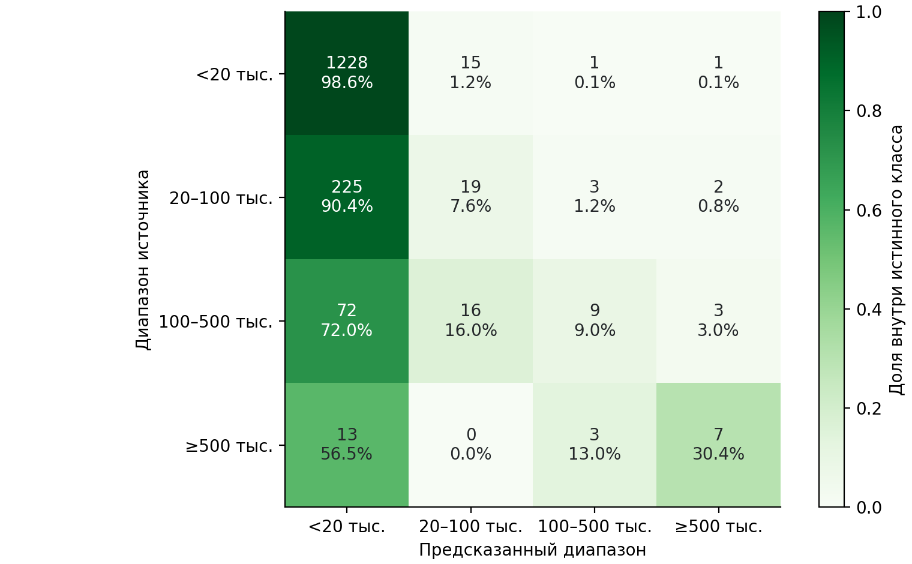
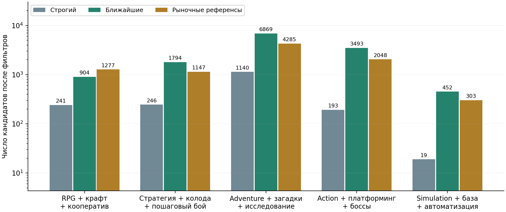
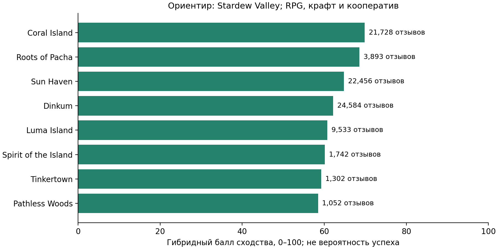

## Резюме

Исследуется связь жанров и игровых механик с масштабом аудитории продуктов Steam. Из закреплённого снимка сформирована выборка 8 000 платных игр, извлечены 36 типов элементов и 18 846 свидетельств. Сопоставлены пять классификаторов с независимыми частями обучения, выбора модели, калибровки и проверки. Выбранная HGB получила test group log loss 0,5954; преимущество взаимодействий статистически не подтверждено. Прогноз доступного игрового времени сопровождается интервалом с test-покрытием 90,4%.

Приложение дополнено отдельным каталогом 94 016 игр, гибким подбором референсов и TF–IDF-сходством тегов с игрой-ориентиром. На пяти контрольных запросах проверены состав выдачи и соблюдение фильтров. Оценки владельцев и отзывы не заменяют продажи; точность коммерческого прогноза и экспертная релевантность рекомендаций требуют дополнительных данных.

**Ключевые слова:** Steam, игровые механики, машинное обучение, неопределённость, поиск аналогов, TF–IDF.

## Введение

Разработчик выбирает жанр, механики и цену до появления полной информации о спросе. Анализ существующих игр помогает сопоставить концепцию с наблюдаемыми продуктами. Однако популярность отдельных компонентов не гарантирует качество их сочетания. Исследования Steam уже рассматривали прогноз популярности по жанрам и контексту [12], а также классификации игровых понятий по тегам [13]. В данной работе проверяется конкретная гипотеза и разрабатывается приложение для исследования концепций.

**Цель:** оценить воспроизводимый подход к прогнозированию масштаба аудитории и поиску сопоставимых игр. Задачи: подготовить корпус; извлечь механики; сравнить модели; исследовать ошибки и неопределённость; реализовать конструктор и повторение эксперимента. **Гипотеза:** разрешение взаимодействий признаков в HGB уменьшает ошибку относительно сопоставимого варианта с ограничением взаимодействий. Собственный вклад включает конвейер данных, контроль утечек и прозрачный подбор аналогов; новый алгоритм ML или мировой приоритет не заявляются.

## 1. Данные и методология

### 1.1 Корпус и целевые переменные

Источник — Steam Games Dataset автора FronkonGames [1, 10], закреплённая ревизия `ba4e26785af33bee500e96597068c6e77f4edea9`, CSV версии 20.06.2026. Проверяется SHA-256; исправлен объединённый заголовок DiscountDLC count. Из 125 855 строк после содержательных фильтров осталось 89 170; выбрано 8 000 игр по наименьшим SHA-256(seed:AppID), seed = 42. Отбирались платные продукты с релизом от 2010 года, возрастом не менее 180 дней, разработчиком, описанием и корректным owner-диапазоном. Демо и служебные продукты исключались.

Основная цель — четыре диапазона оценочных владельцев: <20 тыс., 20–100 тыс., 100–500 тыс., ≥500 тыс. SteamSpy предупреждает о погрешностях, особенно малых выборок, и различает владение и продажу [2]. Нижняя категория не означает 20 000 покупателей. Положительные оценки медианных часов доступны у 2 021 игр; пропуски не заменяются нулями. Часы не измеряют D7/D30-retention. Отзывы, владельцы и часы исключены из входов модели.

Используются 53 признака: шесть контекстных, десять жанровых, 36 индикаторов элементов и их количество. Элементы извлекаются из точных тегов, категорий и ограниченных фраз с учётом отрицаний; сохраняются URL и свидетельство [3]. Подготовлено 1 440 задач ручной проверки, заполнено 0; независимые precision/recall пока отсутствуют. Собственный прямой парсер проверен на 36 играх. Лицензия MIT карточки набора не передаёт права на сторонние описания и обложки.

### 1.2 Сравнение моделей и проверка гипотезы

Игры общих разработчиков объединены транзитивно в 6 763 группы. Train/validation/calibration/test содержат соответственно 4 000/1 207/1 176/1 617 игр; группы не пересекаются. Модель выбирается по validation, калибруется отдельно; test применяется для итоговой оценки.

Сравниваются prior, HGB на жанрах и контексте, Logistic Regression и два HGB-классификатора с одинаковыми параметрами [7]. Основная пара отличается ограничением no_interactions: 120 итераций, 15 листьев, минимум 25 наблюдений в листе, learning rate 0,07, L2 = 5, seed = 42. Ограничение относится к входным столбцам; производное число механик не позволяет трактовать модель как полностью независимую по исходным элементам.

Основная метрика — log loss, усреднённая сначала внутри студии, затем по студиям; дополнительно оцениваются balanced accuracy и Brier. Для Δ = L_additive − L_interactions выполнен парный bootstrap по 1 353 test-группам, 1 500 повторений. Sigmoid-калибровка проверяется reliability-кривыми и ECE [5, 8]. Для объяснений используются permutation importance и LIME [6, 9]; они не устанавливают причинный эффект механики.

### 1.3 Поиск аналогов и оценка неопределённости

Для поиска подготовлен отдельный каталог 94 016 игр из того же снимка; неизвестные owner-метки допустимы. Каталог не участвует в обучении или выборе классификатора. Структурный балл S = 0,55(0,7C + 0,3J) + 0,25G + 0,12P + 0,08A объединяет покрытие выбранных механик C, их Жаккар J, жанровое сходство G и близость цены P и возраста A. Для последних используется exp(−|Δlog(1+x)|); вес Indie в жанровом Жаккаре равен 0,1. Без выбранных механик вес жанров равен 0,8.

Режим «Ближайшие» допускает половину выбранных элементов, требует 30 отзывов и подтверждения выбранных Co-op/PvP категориями Steam. «Строгий» требует все элементы и цену в пределах трёхкратного отношения. «Рыночные референсы» допускают четверть элементов, начинают со 100 отзывов и упорядочиваются по отзывам. Отличия режимов показываются явно; фильтры доступны пользователю. Отзывы не входят в S, а рыночный список не меняет прогноз модели.

Теги формата или игра-ориентир уточняют запрос. Общие жанры исключаются, остальные теги представляются L2-нормированными TF–IDF-векторами [15]. Балл равен 100(0,45S + 0,55T), где T — косинусное сходство; ориентир исключается из выдачи. При неизвестных тегах используется S. Веса эвристические, экспертная релевантность ещё не измерена.

Для часов сравниваются медиана, Bayesian Ridge и HGB в шкале log(1 + hours). Интервал строится по calibration-остаткам и связан со split conformal prediction [11]; зависимость игр и сдвиг данных ограничивают перенос гарантий. Он не является байесовским credible interval.

## 2. Результаты и обсуждение

### 2.1 Качество прогноза

По validation выбрана HGB с ограничением взаимодействий (табл. 1, рис. 1). Её test log loss 0,5954 описательно ниже prior на 16,2%; отдельный интервал для этого сравнения не рассчитывался. Для основной пары Δ = −0,0035, 95% bootstrap-интервал [−0,0163; +0,0088]. Преимущество взаимодействий не подтверждено; это не доказывает отсутствие взаимодействий в реальном игровом опыте.

**Таблица 1. Метрики классификаторов; validation до калибровки, test после калибровки**

| Модель | Validation L_group | Test L_group | Test Brier | Balanced accuracy |
| --- | --- | --- | --- | --- |
| Константный prior | 0,6512 | 0,7104 | 0,3795 | 0,2500 |
| HGB: жанры и контекст | 0,5677 | 0,6159 | 0,3312 | 0,3674 |
| Logistic Regression | 0,5358 | 0,6443 | 0,3455 | 0,3490 |
| HGB ограниченная | 0,5294 | 0,5954 | 0,3239 | 0,3642 |
| HGB взаимодействия | 0,5429 | 0,5989 | 0,3266 | 0,3859 |

Общая accuracy выбранной модели 78,1% скрывает дисбаланс: полнота диапазонов составляет 98,6%, 7,6%, 9,0% и 30,4% (рис. 2). Следовательно, крупные аудитории распознаются слабо. Временной тест также ограничен дисбалансом и послерелизными признаками.

Для порога 20 тыс. ECE вырос с 0,0159 до 0,0271 (рис. 3); калибровка не обеспечила улучшения. Для часов по validation выбрана HGB; на test Bayesian Ridge оказалась точнее. Покрытие номинального 90% интервала выбранной модели — 90,4%, но его перенос на новые продукты не подтверждён.

### 2.2 Проверка поиска аналогов

Реконструкция старого top-12 для RPG с крафтом и кооперативом дала 10 игр с менее чем 30 отзывами и 10 без подтверждённого категориями кооператива. Расширение каталога и разделение режимов изменили состав выдачи (табл. 2). Строгий поиск оставляет 241 кандидатов, обычный — 904, широкий — 1 277. Это сравнение ширины и состава поиска, а не независимой точности рекомендаций.

**Таблица 2. Выдача для RPG с крафтом и кооперативом; глубина сравнения 12**

| Режим | Кандидатов | Медиана отзывов в top-12 | Покрытие выбранных механик, % |
| --- | --- | --- | --- |
| Исходный Jaccard (train) | 4 000 до ранжирования | 13,0 | 45,8 |
| Строгий | 241 | 675,0 | 100,0 |
| Ближайшие | 904 | 798,5 | 100,0 |
| Рыночные референсы | 1 277 | 696626,0 | 87,5 |

В широком режиме появляются Terraria, Stardew Valley и Valheim; их заметность не доказывает одинаковый бюджет или игровой цикл. Ориентир Stardew Valley поднимает Coral Island, Roots of Pacha, Sun Haven и Dinkum (рис. 5). Независимые Precision@k/NDCG не заявляются: для них нужна экспертная оценка пар «концепция — игра».

### 2.3 Приложение и воспроизводимость

Game Concept Lab предоставляет конструктор, прогноз диапазонов, часы с интервалом, сценарные сравнения, LIME, аналоги и загрузку совместимого CSV. Для Indie/RPG, крафта и кооператива, цены 14,99 USD, Windows и двух языков P(≥20 тыс.) = 18,8%; оценка часов 4,2, интервал 0,2–21,1. Добавление всех 36 элементов вызывает отказ от численного прогноза при недостатке поддержки.

Свежие сводки отзывов запрашиваются отдельно через GetAppReviews [14]. У Voyagers of Nera снимок содержит 0 отзывов, проверка от 2026-10-08 вернула 2 655. Разные даты и правила подсчёта ограничивают прямое сравнение; новый ответ не заменяет старые цели. Диапазон <20 тыс. и неизвестная аудитория снабжены пояснениями.

Сохранены seed, контрольные суммы, разбиения и предсказания. Проверены неизменность исходных результатов ML и совпадение пересчитанных test-вероятностей; 100 тестов прошли. Интерфейс проверен в Chrome при ширинах 1 440 и 1 920 пикселей. Изменение фильтров и ориентира не меняет прогноз. Подробные протоколы, исходные таблицы и код сборки сохранены в проекте.

## Выводы

Разработан воспроизводимый конвейер анализа Steam и приложение для исследования игровых концепций. Ограниченная HGB получила group log loss 0,5954; гипотеза преимущества взаимодействий не подтверждена. Ошибки редких классов и калибровки показывают пределы практического применения. Поиск расширен до 94 016 игр, добавлены гибкие режимы, ориентир и графики различий.

Результаты остаются ретроспективными: метаданные получены после релиза, проверка извлечения и экспертная оценка ранжирования не завершены. Owner-оценки, отзывы и часы не определяют продажи, прибыль или удержание. Для дальнейшей проверки необходимы независимая разметка, исторические признаки и результаты на фиксированных горизонтах; реальные продажи доступны через авторизованные источники [4].

## Библиография

[1]	FronkonGames. Steam Games Dataset. Hugging Face. DOI: 10.57967/hf/0511. В эксперименте: ревизия ba4e26785af33bee500e96597068c6e77f4edea9, games.csv версии 20.06.2026. [Карточка набора](https://huggingface.co/datasets/FronkonGames/steam-games-dataset). Дата обращения: 08.10.2026.

[2]	Galyonkin S. About Steam Spy: methodology and interpretation of owners. [Описание SteamSpy](https://steamspy.com/about). Дата обращения: 08.10.2026.

[3]	Valve. Steam Tags. Steamworks Documentation. [Документация тегов](https://partner.steamgames.com/doc/store/tags). Дата обращения: 08.10.2026.

[4]	Valve. Reporting and Payments. Steamworks Documentation. [Финансовая отчётность](https://partner.steamgames.com/doc/finance/payments_salesreporting). Дата обращения: 08.10.2026.

[5]	Guo C., Pleiss G., Sun Y., Weinberger K. Q. On Calibration of Modern Neural Networks. ICML, 2017. [arXiv:1706.04599](https://arxiv.org/abs/1706.04599).

[6]	Ribeiro M. T., Singh S., Guestrin C. "Why Should I Trust You?": Explaining the Predictions of Any Classifier. 2016. [arXiv:1602.04938](https://arxiv.org/abs/1602.04938).

[7]	scikit-learn developers. HistGradientBoostingClassifier. Документация версии 1.8.0. [Описание алгоритма и interaction_cst](https://scikit-learn.org/1.8/modules/generated/sklearn.ensemble.HistGradientBoostingClassifier.html). Дата обращения: 08.10.2026.

[8]	scikit-learn developers. Probability calibration. Документация версии 1.8.0. [Калибровка вероятностей](https://scikit-learn.org/1.8/modules/calibration.html). Дата обращения: 08.10.2026.

[9]	scikit-learn developers. Permutation feature importance. Документация версии 1.8.0. [Перестановочная важность](https://scikit-learn.org/1.8/modules/permutation_importance.html). Дата обращения: 08.10.2026.

[10]	FronkonGames. Steam-Games-Scraper. [Исходный код сборщика](https://github.com/FronkonGames/Steam-Games-Scraper). Дата обращения: 08.10.2026.

[11]	Angelopoulos A. N., Bates S. A Gentle Introduction to Conformal Prediction and Distribution-Free Uncertainty Quantification. 2021; обновление 2022. [arXiv:2107.07511](https://arxiv.org/abs/2107.07511).

[12]	De Luisa A., Hartman J., Nabergoj D., Pahor S., Rus M., Stevanoski B., Demšar J., Štrumbelj E. Predicting the Popularity of Games on Steam. 2021. [arXiv:2110.02896](https://arxiv.org/abs/2110.02896).

[13]	Grelier N., Kaufmann S. Data-Driven Classifications of Video Game Vocabulary. 2023. [arXiv:2303.07179](https://arxiv.org/abs/2303.07179).

[14]	Valve. IUserReviewsService: GetAppReviews. [Steamworks Documentation](https://partner.steamgames.com/doc/webapi/IUserReviewsService). Дата обращения: 09.10.2026.

[15]	scikit-learn developers. TfidfVectorizer. [Документация](https://scikit-learn.org/stable/modules/generated/sklearn.feature_extraction.text.TfidfVectorizer.html). Дата обращения: 09.10.2026.
